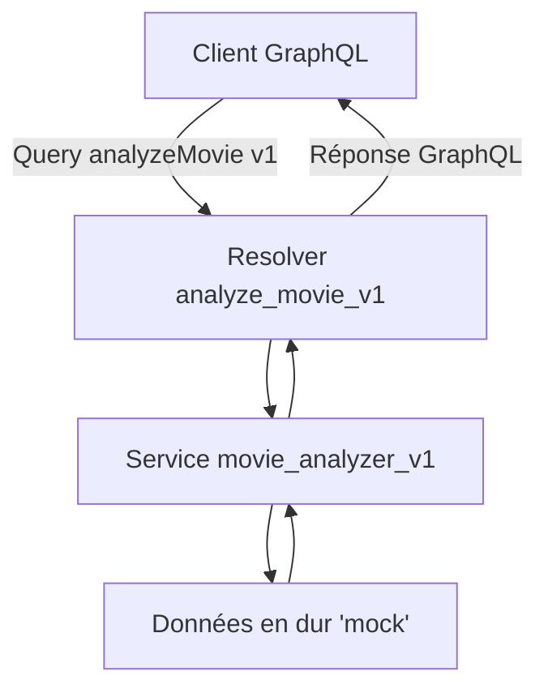
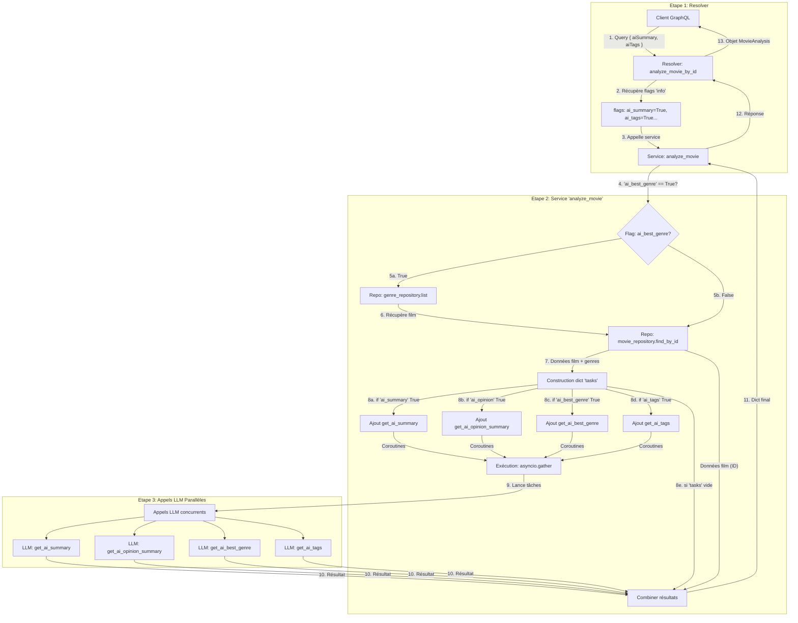

# TP : API IA d'analyse de films (GraphQL & LLM)

## Informations générales

**Cours** : Python Avancé > REST API > Fast API \
**Objectifs pédagogiques** :
- Mettre en place une API GraphQL avec Strawberry sur une base FastAPI existante.
- Structurer une application en couches (API, BLL/Services, DAL/Repository).
- Définir des schémas de données avec Pydantic pour la validation et la sérialisation.
- Interagir avec une API externe de manière asynchrone.
- Gérer les erreurs métier et les remonter proprement dans GraphQL.
- Intégrer un Large Language Model (LLM) pour des fonctionnalités d'IA.
- Optimiser les appels au LLM en fonction des champs demandés par le client GraphQL.

-----

## Objectif

L'objectif de ce TP est de construire une API GraphQL performante en utilisant FastAPI et Strawberry. Cette API exposera un endpoint capable d'analyser des films. Pour cela, elle ira chercher les informations d'un film depuis une API REST externe, puis utilisera un Large Language Model (LLM) local (via LM Studio) pour générer des analyses intelligentes et dynamiques, comme des résumés, des tags pertinents ou le genre le plus approprié.

Nous nous concentrerons sur l'implémentation des couches de services et de repositories, ainsi que sur la définition des types et resolvers GraphQL, en nous appuyant sur une structure de projet déjà initialisée.

-----

## Prérequis

* Avoir une instance de **LM Studio** (ainsi que le serveur associé) qui tourne localement, avec le modèle `gemma-3-1b-it-qat` (ou `meta-llama-3.1-8b-instruct`) prêt à l'emploi.
* Avoir lancé l'**API REST de films** (c'est-à-dire le TP1, dont l'API REST est supposée tourner sur `http://127.0.0.1:8000`). En effet, ce microservice GraphQL (TP2) doit pouvoir s'appuyer sur le microservice REST (TP1) qui fournit les informations sur les films de la filmothèque, afin de pouvoir proposer des services IA sur ces mêmes films.
* Après avoir récupéré le projet, installez les dépendances via `uv` :
    ```bash
    uv sync
    ```
* A ce stade, si vos imports ne sont pas reconnus dans l'IDE PyCharm à l'ouverture d'un fichier (par exemple `app/main.py`), marquer le répertoire `src` comme `Sources Root` (Clic droit sur répertoire `src`, puis `Mark Directory as ... > Sources Root`) ou redémarrer l'IDE (File > Invalidate Caches... > Just restart à gauche).
* Pour démarrer le serveur GraphQL, utilisez la commande suivante à la racine du projet :
    ```bash
    # En étant à la racine du projet
    cd src
    uv run uvicorn app.main:app --host 0.0.0.0 --port 8002
    ```
* Ouvrez un client GraphQL comme Apollo Studio Sandbox :
    [https://studio.apollographql.com/sandbox/explorer/](https://studio.apollographql.com/sandbox/explorer/)

* Renseignez dans l'outil l'URL de votre serveur local : `http://127.0.0.1:8002/graphql`

À noter que vous pouvez aussi utiliser l'interface incluse GraphiQL en vous rendant à l'adresse : http://127.0.0.1:8002/graphql

Attention : si vous êtes derrière un proxy, vous devez définir en haut de votre fichier Python `main.py` :

```python
import os
os.environ["NO_PROXY"] = "127.0.0.1,localhost"
```

-----

## Étape 1 : Prise en main du projet et configuration

Le projet qui vous est fourni contient déjà une structure de base pour vous permettre de vous concentrer sur l'essentiel.

1.  **Explorez la structure du projet** : vous remarquerez les fichiers suivants, déjà créés et configurés pour vous :
    * `app/main.py` : point d'entrée de l'application FastAPI, avec le routeur GraphQL déjà configuré.
    * `app/core/config.py` : gestion de la configuration via Pydantic et les variables d'environnement.
    * `app/core/exceptions.py` : définition des exceptions personnalisées pour la couche métier (BLL) et la couche d'accès aux données (DAL).
    * `app/core/llm.py` : initialisation du client pour communiquer avec le LLM.
    * `app/graphql/context.py` : fonction pour injecter l'instance du LLM dans le contexte de chaque requête GraphQL.
    * `app/graphql/extensions.py` : extension Strawberry pour une gestion propre des erreurs métier (`BLLException`).
    * `app/graphql/mutations.py` : une mutation `_noop` pour assurer un schéma valide.

2.  **Complétez l'arborescence de fichiers** : créez les dossiers et fichiers vides qui manquent pour atteindre la structure cible :
    ```
    .
    ├── app
    │   ├── core
    │   │   ├── config.py         # Fourni
    │   │   ├── exceptions.py     # Fourni
    │   │   └── llm.py            # Fourni
    │   ├── graphql
    │   │   ├── inputs
    │   │   │   └── movie_input.py  # Fourni
    │   │   ├── resolvers
    │   │   │   ├── analyze_movie_v1.py # A créer (étape 3)
    │   │   │   ├── analyze_movie_v2.py # A créer (étape 6)
    │   │   │   └── helper.py           # Fourni
    │   │   ├── types
    │   │   │   └── movie_analysis.py # Fourni
    │   │   ├── context.py        # Fourni
    │   │   ├── extensions.py     # Fourni
    │   │   ├── mutations.py      # Fourni
    │   │   └── queries.py        # A créer (étape 3)
    │   ├── models
    │   │   ├── genre.py          # Fourni
    │   │   ├── member.py         # Fourni
    │   │   ├── movie.py          # Fourni
    │   │   ├── opinion.py        # Fourni
    │   │   └── person.py         # Fourni
    │   ├── repositories
    │   │   ├── _base_client.py   # Fourni
    │   │   ├── genre_repository.py # A créer (étape 2)
    │   │   └── movie_repository.py # A créer (étape 2)
    │   └── services
    │       ├── movie_analyzer_v1.py # A créer (étape 3)
    │       └── movie_analyzer_v2.py # A créer (étape 5)
    ├── .env                    # A créer (étape 1) OU utiliser variables d'env.
    └── main.py                 # Fourni (dans app/)
    ```

3.  Créez un fichier **`.env`** à la racine du projet pour configurer les URLs. Cela permet de modifier les configurations sans toucher au code.
    ```.env
    BACKEND_CORS_ORIGINS=["http://localhost:4200"] # En prévision de l'accès depuis un front Angular.
    ```

**Astuce** : vous pouvez aussi définir ces variables d'environnement directement dans votre terminal avant de lancer l'application sous PyCharm. Faites clic droit "Settings" sur le terminal, puis modifier ces variables dans l'onglet "Environment Variables".

---

## Étape 2 : couche d'accès aux données (Repositories)

La couche "Repository" est responsable de toute interaction avec des sources de données externes, ici notre API REST de films.

Complétez les `TODO` des **repositories** pour les films et les genres.

- `app/repositories/movie_repository.py` : contiendra les méthodes pour récupérer un ou plusieurs films. La méthode `find_by_id` devra retourner `None` si le film n'est pas trouvé (status code 404).
- `app/repositories/genre_repository.py` : contiendra la méthode pour lister tous les genres disponibles.

A ce stade, vous devriez pouvoir tester votre travail avec la commande suivante : `uv run pytest tests/test_etape2_dal_repositories.py`.

---

## Étape 3 : mise en place de GraphQL (Version 1 - Statique)

Nous allons construire la structure de notre API GraphQL avec une première version qui renvoie des données en dur, pour valider la mise en place.

1.  Observez le **type de sortie GraphQL** dans `app/graphql/types/movie_analysis.py`. Ce sera l'objet que notre API retournera.

2.  Complétez un premier **service d'analyse statique** dans `app/services/movie_analyzer_v1.py`. Ce service prendra un `movie_id` et retournera un dictionnaire avec des données pré-remplies, simulant une analyse IA.

3.  Complétez le **resolver GraphQL** dans `app/graphql/resolvers/analyze_movie_v1.py`. Un resolver est une fonction qui sait comment obtenir les données pour un champ. Celui-ci appellera votre service `movie_analyzer_v1`.



4. Exposez le resolver dans le schéma Mettez à jour le fichier `app/graphql/queries.py` pour importer votre resolver `analyze_movie_by_id` (depuis `app.graphql.resolvers.analyze_movie_v1`) et l'ajouter au type Query.

```python
# app/graphql/queries.py
import strawberry
# Importer le resolver V1
from app.graphql.resolvers.analyze_movie_v1 import analyze_movie_by_id
from app.graphql.types.movie_analysis import MovieAnalysis

@strawberry.type
class Query:
    """
    Point d'entrée pour toutes les requêtes GraphQL de type 'query'.
    """
    # Remplacer le TODO par ceci :
    analyzeMovie: MovieAnalysis = strawberry.field(
        resolver=analyze_movie_by_id,
        description="Analyse un film en utilisant l'IA (version 1 statique)."
    )
```

A ce stade, vous devriez pouvoir tester votre travail avec la commande suivante : `uv run pytest tests/test_etape3_graphql_v1.py`.

À ce stade, vous devriez pouvoir lancer l'application et tester la query suivante dans votre client GraphQL pour recevoir les données statiques :

```graphql
query AnalyzeMovieByID {
  analyzeMovie(movieId: "1") {
    id
    aiSummary
    aiOpinionSummary
    aiBestGenre
    aiTags
  }
}
```

À ce stade, **assurez-vous svp** que dans `app\graphql\queries.py`, vous ayez `from app.graphql.resolvers.analyze_movie_v1 import analyze_movie_by_id` (et non `from app.graphql.resolvers.analyze_movie_v2 import analyze_movie_by_id`)

---

## Étape 4 : Comprendre l'Intégration du LLM

Le mécanisme d'intégration du LLM est déjà en place. Prenez un moment pour comprendre comment il fonctionne :

1.  **`app/core/llm.py`** : ce fichier crée une instance unique de `ChatOpenAI` en utilisant les paramètres du fichier `.env` (ou variables d'environnement, ou les valeurs par défaut de votre fichier `config.py`). Cette instance sera partagée par toute l'application.
2.  **`app/graphql/context.py`** : la fonction `get_context` est appelée pour chaque requête GraphQL et y injecte notre instance `llm`.
3.  **`app/main.py`** : lors de la création du `GraphQLRouter`, nous passons notre fonction `get_context`. Ainsi, chaque resolver pourra accéder au LLM via `info.context["llm"]`.

---

## Étape 5 : service d'analyse avancé (Version 2 - Dynamique)

Nous allons créer le service qui interagit réellement avec le LLM pour générer des analyses.

Complétez le fichier **`app/services/movie_analyzer_v2.py`**.

A ce stade, vous devriez pouvoir tester votre travail avec la commande suivante : `uv run pytest tests/test_etape5_service_v2.py`.

---

## Étape 6 : optimisation du Resolver GraphQL (Version 2)

Un client GraphQL peut demander seulement un sous-ensemble des champs disponibles.
Nous allons optimiser notre resolver pour n'appeler le LLM que pour les champs réellement demandés.
En effet, l'appel à un LLM est coûteux en temps et en ressources, on souhaite donc éviter les appels inutiles.

1.  Observez la **fonction utilitaire** dans `app/graphql/resolvers/helper.py` nommée `is_field_requested(info: Info, field_name: str) -> bool`.

2.  Complétez le **nouveau resolver** dans `app/graphql/resolvers/analyze_movie_v2.py`. Il doit :
    * récupérer l'instance `llm` depuis le contexte (`info.context["llm"]`).
    * utiliser votre helper `is_field_requested` pour déterminer quels arguments booléens passer au service `movie_analyzer_v2`.
    * appeler le service et retourner le résultat.

3.  Mettez à jour **`app/graphql/queries.py`** pour qu'il utilise ce nouveau resolver `analyze_movie_v2`.

À ce stade, **assurez-vous svp** que dans `app\graphql\queries.py`, vous ayez `from app.graphql.resolvers.analyze_movie_v2 import analyze_movie_by_id` (et non `from app.graphql.resolvers.analyze_movie_v1 import analyze_movie_by_id`)

---



A ce stade, vous devriez pouvoir tester votre travail avec la commande suivante : `uv run pytest tests/test_etape6_resolver_v2.py`.

-----

## Étape 7 (bonus) : Comprendre la gestion fine des erreurs métier

Le mécanisme pour retourner des erreurs claires au client est déjà en place.

1.  **Examinez `app/graphql/extensions.py`** : la classe `BusinessLogicErrorExtension` intercepte les erreurs. Si une erreur est une instance de `BLLException` (comme `NotFoundBLLException`), elle reformate le message et ajoute un code d'erreur dans la réponse GraphQL.
2.  **Examinez `app/main.py`** : vous verrez que cette extension est passée à `strawberry.Schema` lors de sa création, ce qui l'active pour toutes les requêtes.

Pour tester, essayez de demander un film avec un ID qui n'existe pas. Vous devriez voir une erreur GraphQL formatée.

À ce stade, vous devriez pouvoir tester votre travail avec la commande suivante : `uv run pytest tests/test_etape7_erreurs.py`.

---

## Conclusion

Vous avez construit une API GraphQL complète, asynchrone et optimisée qui s'appuie sur la puissance d'un LLM pour fournir des données enrichies. Vous avez mis en pratique des concepts d'architecture logicielle, de programmation asynchrone et d'optimisation des requêtes.